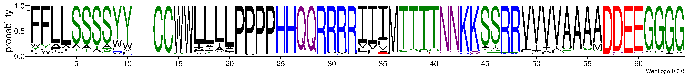

# PORC

This code predicts genetic codes with an alternative normalization scheme to that implemented in the program [FACIL](http://facil.cmbi.umcn.nl/facil/cgi-bin/display.pl?disp=home). 

PORC was used to predict a few new genetic codes in cilates using MMETSP transcriptome data (https://pubmed.ncbi.nlm.nih.gov/27426948/), recorded as genetic codes 27-29 in [NCBI Genetic Codes](https://www.ncbi.nlm.nih.gov/Taxonomy/Utils/wprintgc.cgi), and also in analyses of [karyorelict genetic codes](https://doi.org/10.1101/2022.04.12.488043).
